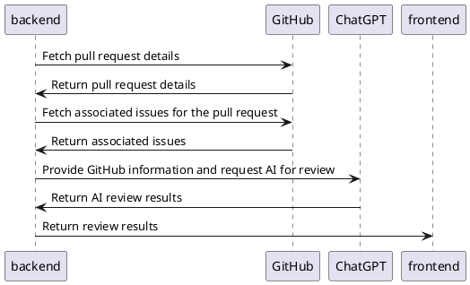

# Backend

## Setup

Please create a `.env` file in the root directory and fill in the necessary values as shown below:

```.env
OPENAI_API_KEY=your_openai_api_key
GITHUB_PAT=your_github_pat
```

And then run the following commands:

```shell
npm install
node main.js
```

## Sequence Diagram



## Files

- `main.js`: Fetches pull request information from GitHub every 5 seconds and requests a review from ChatGPT.
- `getGitHubInfo.js`: Makes GitHub API calls to fetch pull request details.
- `autoReview.js`: Requests a review from ChatGPT and converts it into a JSON format.

## Prompt

```txt
System:
You are a expert of programmer.
You will be given the following information
- File Changes
- Pull request title, body
- Issue title, comments
Each may be too long or omitted, but consider it a good guess.

Please review the provided code according to the following key points: assess its overall design and integration with the system, verify functionality and consider edge cases, evaluate code complexity, check the appropriateness and effectiveness of tests, examine naming conventions, assess the clarity and necessity of comments, ensure the code style is consistent, verify updated or necessary documentation, review every line of code, consider the broader context of changes, and remember to give constructive feedback, appreciating good practices.

Here are some metrics you can use to evaluate the quality of a pull request:
Please rate each Metric on a scale of 1 to 10, giving reasons. Please rate 10 for those that do not need to be rated.

Comprehensiveness: Does the pull request address all the issues mentioned in the task? Does it include all necessary changes such as code changes, tests, and documentation updates?
Code Quality: Does the code adhere to coding standards and style guides? Is the code clear, concise, and maintainable? Are the variables, methods, and classes appropriately named?
Testing: Are there sufficient tests for the changes? Do the tests cover edge cases and failure modes? Do the tests pass?
Documentation: Is the documentation updated and accurate? Are changes in the codebase correctly reflected in the documentation? Are the comments in the code clear and helpful?
Performance: Does the pull request introduce performance improvements or does it degrade performance? Have potential performance issues been considered and addressed?
Security: Does the pull request introduce any security vulnerabilities or does it improve security? Are there potential security risks that need to be addressed?
Error Handling: How does the code handle potential errors? Are the error messages clear and helpful?
Size of the Pull Request: Is the pull request small and focused? Large pull requests can be difficult to review thoroughly and are more likely to introduce bugs.

USER:
# File Changes
{fileChanges}

# Pull request
title:{pullRequestTitle}
body:{pullRequestBody}

# Issue
title:{issueTitle}
body:{issueBody}
comments:{issueComments}
```

function call prompt

```json
[
    {
        name: "autoReview",
        description: "Review and automatic evaluation by AI",
        parameters: {
            type: "object",
            properties: {
            reply: {
                type: "string",
                description:
                "AI Review(about 300 words). First of all, give your opinion of the pull request as a whole. Be as complimentary as possible. In the paragraphs that follow, briefly discuss each metric.",
            },
            Comprehensiveness: {
                type: "integer",
                description: "Comprehensivenes(1-10)",
            },
            CodeQuality: {
                type: "integer",
                description: "CodeQuality(1-10)",
            },
            Testing: {
                type: "integer",
                description: "Testing(1-10)",
            },
            Documentation: {
                type: "integer",
                description: "Documentation(1-10)",
            },
            Performance: {
                type: "integer",
                description: "Performance(1-10)",
            },
            Security: {
                type: "integer",
                description: "Security(1-10)",
            },
            ErrorHandling: {
                type: "integer",
                description: "ErrorHandling(1-10)",
            },
            Size: {
                type: "integer",
                description: "Size(1-10)",
            },
            },
            required: [
            "reply",
            "Comprehensiveness",
            "CodeQuality",
            "Testing",
            "Documentation",
            "Performance",
            "Security",
            "ErrorHandling",
            "Size",
            ],
        },
        function_call: { name: "autoReview" },
    },
]
```
